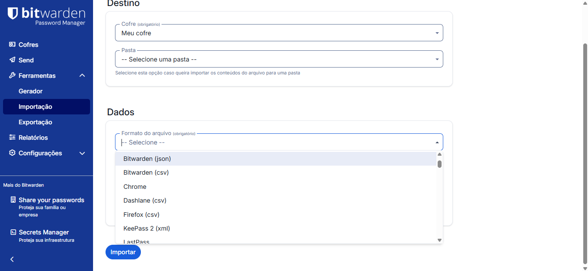
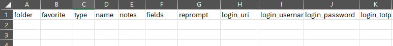

# Bitwarden

Este repositório reúne um guia completo para instalação, configuração e utilização de um servidor Bitwarden self-hosted, bem como o funcionamento do software.

# Visão Geral

O Bitwarden é uma solução segura e de fácil utilização para gerenciamento de senhas.
Entre seus principais recursos estão a geração de senhas aleatórias com níveis de complexidade definidos pelo usuário e a possibilidade de utilizar extensões para navegadores, que permitem o preenchimento automático das credenciais.

# Pre-requisitos

Este repositório irá instalar o Bitwarden em um servidor Linux (Ubuntu Server).

Especificações recomendadas do sistema:

- Processador: x64, dual core de 2GHz;
- Memória: 4GB de RAM;
- Armazenamento: 25GB;
- Versão do Docker: Motor 26+ e Compose;

# Instalação

Para um guia de como instalar o Ubuntu Server: 

```
https://youtu.be/uUUCLoDyIx8?si=HyztHFpD30TIMJpZ
```

## O bitwarden será implantando utilizando docker, então para instalar o docker:

```
  sudo install -m 0755 -d /etc/apt/keyrings
	sudo curl -fsSL https://download.docker.com/linux/ubuntu/gpg -o /etc/apt/keyrings/docker.asc
	sudo chmod a+r /etc/apt/keyrings/docker.asc
	echo "deb [arch=$(dpkg --print-architecture) signed-by=/etc/apt/keyrings/docker.asc] https://download.docker.com/linux/ubuntu $(. /etc/os-release && echo "${UBUNTU_CODENAME:-$VERSION_CODENAME}") stable" | sudo tee /etc/apt/sources.list.d/docker.list > /dev/null
	sudo apt update
	sudo apt install docker-ce docker-ce-cli containerd.io docker-buildx-plugin docker-compose-plugin
```

## Criar um usuário que inicializará e utilizará o bitwarden, e seu diretório

Vale destacar que o usuario não pode ter permissão root, como descrito na documentação do Bitwarden, justificando assim sua criação.

Para criar o usuário, seu diretório e adicionar ao grupo docker:

```
  sudo adduser bitwarden_usr
	sudo addgroup docker
	sudo adduser bitwarden_usr docker
	sudo mkdir /opt/bitwarden_usr
	sudo chmod -R 700 /opt/bitwarden_usr
	sudo chown -R bitwarden_usr:bitwarden_usr /opt/bitwarden_usr
```
## Instalar o Bitwarden

Primeiramente, é necessário definir um domínio para o Bitwarden, seja ele local ou público.

Neste repositório, utilizaremos um domínio local, que pode ser fácilmente criado em seu roteador ou servidor DNS.

O domínio utilizado neste guia será: "bitwarden.f3f.local".

Tendo o domínio definido, seguimos com a instalação:

```
  su bitwarden_usr
	cd /opt/bitwarden_usr
	curl -Lso bitwarden.sh "https://func.bitwarden.com/api/dl/?app=self-host&platform=linux" && chmod 700 bitwarden.sh
	./bitwarden.sh install
```
após isso, aparecerá o menu de instalação, onde você terá que responder as seguintes questões (irei responder com o meu caso em específico):

Nome do dominio: ´bitwarden.local´
Deseja que seja criado um certificado Let´s encrypt para o seu dominio? ´n´ (pois como é local, iremos configurar manualmente)
Nome do banco de dados: ´secretname´
Indicar o id de instalação: Nesse passo entraremos no endereço indicado e apontaremos nosso e-mail e a região (US), para assim gerar o id. 
Indicar a key da instalação: gerada no passo anterior
Região: US
Gerar um certificado ssl autoassinado: ´y´

A partir disso o bitwarden será instalado. 
Para iniciar basta estar logado no usuário bitwarden_usr e digitar os seguintes comandos:

```
- cd /opt/bitwarden_usr
- ./bitwarden.sh start
```

e para acessar basta digitar no navegador: bitwarden.local.

# Como Funciona

## Importe seus dados

o Bitwarden oferece diversas opções de importação de dados, como importar de outros softwares de senha, de arquivos json, arquivos .csv, etc.. 

Para verificar todos os tipos disponíveis acesse "Ferramentas -> Importação -> Dados -> Formato do arquivo".





Aqui iremos importar de um arquivo .csv, utilizando o formato do arquivo "Bitwarden (csv)".

Primeiramente é necessário formatar os dados em um padrão aceito pelo Bitwarden.




[Explicação dos Campos](./documentos/Campos-bitwarden.txt)


Após formatar os dados, basta salvar o arquivo, selecioná-lo (indicando que está no formato Bitwarden (csv)) e clicar em "Importar".

## Adicione um usuário pela interface web

Entre em bitwarden.f3f.local e localize o botão “Novo”:


Selecione a opção desejada, a mais comum é “Credenciais”:


Preencha os campos para adicionar as credenciais desejadas:


## Visualização dos dados 

Na aba "cofres" irá aparecer todas as credenciais cadastradas, organizadas por pastas.

Para verificar as informações de uma credencial basta clicar em cima de seu nome que aparecerá um box contendo as informações cadastradas, no box você conseguirá copiar o login e a senha, acessar o site (caso tenha algum atrelado), editar e excluir.

Caso deseje editar a credencial você contará com um assistente diretamente no box para criar uma senha aleatória, e poderá editar qualquer informação da credencial (!).

Caso deseje excluir a credencial basta clicar no ícone de lixeira no canto inferior direito e confirmar a ação, vale ressaltar que o item não será excluido permanentemente, apenas será redirecionado para a pasta "lixeira" onde será automaticamente excluido após 30 dias.

### Filtragem de dados

Há a possibilidade de filtrar a pesquisa por pastas, selecionando a pasta desejada e indicando o valor que deseja buscar, ou filtrar em cima de todas as credenciais existentes na base de dados, selecionando "meu cofre" e indicando o valor que deseja buscar.


# Erros comuns

